# 🏗️ IoT Delta Lakehouse (Databricks + PySpark)

[](https://opensource.org/licenses/MIT)
[](https://www.python.org/)
[](https://spark.apache.org/)
[](https://delta.io/)

A production-grade Delta Lakehouse pipeline that ingests, transforms, and analyzes IoT sensor logs using Apache Spark, Delta Lake, and Databricks Community Edition.

> Supports both batch and streaming ingestion, layered data architecture (Bronze/Silver/Gold), time travel, Z-Ordering, and external CSV export.

---

## 📦 Tech Stack

- **Apache Spark (PySpark)** – distributed data processing
- **Delta Lake** – ACID transactions and data versioning
- **Databricks** – notebook orchestration and Delta integration
- **Structured Streaming** – real-time file ingestion
- **Pandas + Flask** *(optional)* – lightweight API server
- **Power BI** *(optional)* – BI/visualization layer

---

## 📁 Project Structure

```
iot-delta-lakehouse/
├── notebooks/ # All Databricks notebooks (Bronze, Silver, Gold, etc.)
├── src/ # Python scripts for local Delta processing
├── data/ # Raw CSV files (ignored in version control)
├── delta_tables/ # Output Delta tables (ignored in version control)
├── .gitignore
├── README.md
└── requirements.txt
```

> ✅ All raw and output data folders are excluded from version control.

---

## 🏗️ Layered Architecture

| Layer  | Description                                      |
|--------|--------------------------------------------------|
| Bronze | Raw sensor logs (batch + streaming support)      |
| Silver | Cleaned, deduplicated, schema-validated data     |
| Gold   | Aggregated hourly temperature + humidity metrics |

---

## 📈 End-to-End Flow

```mermaid
flowchart LR

  %% ---------- INGESTION ----------
  subgraph Ingest
    A1[📄 Batch CSV:<br/>sensor_logs.csv] --> B1(Bronze_Ingest_Batch.py)
    A2[📄 Streaming CSV:<br/>/FileStore/iot_stream] --> B2(Bronze_Ingest_Stream.py)
  end

  %% ---------- BRONZE ----------
  subgraph Bronze Layer
    B1 --> DB[Delta Table:<br/><b>bronze/sensor_logs</b>]
    B2 --> DB
  end

  %% ---------- SILVER ----------
  subgraph Silver Layer
    DB --> C1[Silver_Transform.py]
    C1 --> DS[Delta Table:<br/><b>silver/sensor_logs</b>]
  end

  %% ---------- GOLD ----------
  subgraph Gold Layer
    DS --> D1[Gold_Aggregate.py]
    D1 --> DG[Delta Table:<br/><b>gold/sensor_hourly_avg</b>]
  end

  %% ---------- EXPORT ----------
  subgraph Export
    DG --> E1[📤 Export CSV:<br/>iot_gold_export.csv]
    E1 --> LINK[🌐 Download via<br/>FileStore]
  end

  %% ---------- STYLES ----------
  style A1 fill:#fffbe7,stroke:#444
  style A2 fill:#fffbe7,stroke:#444
  style B1 fill:#dde1ff,stroke:#444
  style B2 fill:#dde1ff,stroke:#444
  style DB fill:#cfe2f3,stroke:#444
  style C1 fill:#d9ead3,stroke:#444
  style DS fill:#b6d7a8,stroke:#444
  style D1 fill:#fce5cd,stroke:#444
  style DG fill:#f9cb9c,stroke:#444
  style E1 fill:#f4cccc,stroke:#444
  style LINK fill:#e7f5ff,stroke:#444
```



---

## 📘 Component Glossary

| Component                 | Type            | Description                                                               |
| ------------------------- | --------------- | ------------------------------------------------------------------------- |
| `sensor_logs.csv`         | Batch Input     | Static raw IoT sensor data file ingested into the Bronze layer            |
| `/FileStore/iot_stream`   | Streaming Input | Simulated folder for real-time file drops triggering stream ingestion     |
| `Bronze_Ingest_Batch.py`  | PySpark Script  | Handles one-time batch ingestion into Delta Bronze table                  |
| `Bronze_Ingest_Stream.py` | PySpark Script  | Listens for new streaming files and ingests into Bronze Delta Lake        |
| `bronze/sensor_logs`      | Delta Table     | Raw ingested sensor logs (schema-on-read + append-only)                   |
| `Silver_Transform.py`     | PySpark Script  | Cleans, deduplicates, and filters data for the Silver layer               |
| `silver/sensor_logs`      | Delta Table     | Validated and refined version of Bronze data                              |
| `Gold_Aggregate.py`       | PySpark Script  | Aggregates hourly temperature and humidity metrics                        |
| `gold/sensor_hourly_avg`  | Delta Table     | Final analytical dataset ready for BI or export                           |
| `iot_gold_export.csv`     | Exported CSV    | Final gold-layer dataset available for download from Databricks FileStore |
| `FileStore`               | Databricks Path | Accessible public path to download files or simulate streams              |

---

## ⚙️ How to Use

### ▶️ 1. Run in Databricks

1. Upload all `notebooks/` into your Databricks Workspace.
2. Create `/FileStore/iot_stream` to simulate streaming input.
3. Run the following notebooks in order:
   - `Bronze_Ingest_Batch`
   - `Silver_Transform`
   - `Gold_Aggregate`
   - Or use `Pipeline_Run_All` to execute them sequentially.

---

### ⚡ 2. Simulate Streaming Ingestion

- Drop a new CSV file (e.g., `batch1.csv`) into `/FileStore/iot_stream`
- It will be ingested in real time by `Bronze_Ingest_Stream`
- Rerun Silver and Gold notebooks to propagate results

---

### 📤 3. Export Gold Layer to CSV

Use the `Gold_Export_to_CSV` notebook (or `src/export_gold_csv.py`) to:
- Export the `sensor_hourly_avg` table
- Rename and download via:

👉 [iot_gold_export](https://community.cloud.databricks.com/files/gold_export/iot_gold_export.csv)

---

## 🧪 Sample Data Format

To test the pipeline locally or in Databricks, create a file named:

```text
data/sample_sensor_data.csv
```
With the following content:
```csv
sensor_id,timestamp,temperature,humidity,location
1001,2025-05-01 00:00:00,72.4,41.2,Room_A
1002,2025-05-01 00:00:05,75.1,45.9,Room_B
```
You can manually drop this into /FileStore/iot_stream to simulate a stream event.

---

## ✨ Advanced Features Implemented

- [x] Bronze/Silver/Gold data lake layers
- [x] Structured Streaming ingestion
- [x] Delta Time Travel with versioning
- [x] Z-Ordering (manual simulation)
- [x] Notebook chaining with `%run`
- [x] CSV export for BI tools
- [ ] (Optional) REST API with Flask
- [ ] (Optional) Power BI integration via Databricks SQL

---

## 💡 Ideas to Expand the Pipeline

| Idea                                           | Description                                                                |
| ---------------------------------------------- | -------------------------------------------------------------------------- |
| **Anomaly Detection in Gold Layer**            | Use statistical thresholds or ML to flag temperature/humidity outliers     |
| **Alert System Integration**                   | Send email, Slack, or webhook alerts for anomalies or threshold breaches   |
| **Power BI or Tableau Integration**            | Connect directly to the Gold Delta table using JDBC or exported CSV        |
| **Airflow Orchestration**                      | Replace Databricks Jobs with Apache Airflow for cross-platform scheduling  |
| **Delta Table Partitioning by Date**           | Improve performance by partitioning on `date(timestamp)` in large datasets |
| **Cloud Integration (AWS S3)**                 | Store Delta tables in S3 for scalable, production-grade deployments        |
| **REST API with Flask/FastAPI**                | Expose Gold data through REST endpoints for external access or dashboards  |
| **Real-Time Dashboard with Dash or Streamlit** | Visualize streaming updates live in a browser-based dashboard              |
| **CI/CD for Notebook Validation**              | Lint, test, and auto-deploy Databricks notebooks with GitHub Actions       |
| **Schema Evolution & Drift Detection**         | Automatically handle and flag new sensor schema versions                   |

---

## 👨‍💻 Author

Derek Acevedo
[GitHub](www.github.com/poloman2308) • [LinkedIn](www.linkedin.com/in/derekacevedo86)
